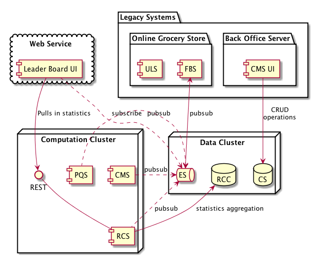
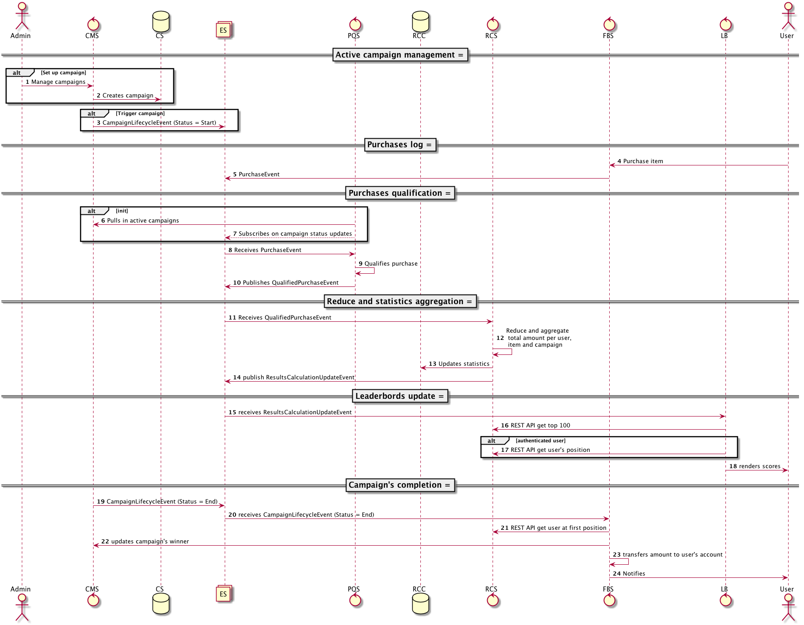

# Campaign Management Scoring System (CMSS)

- Version: 0.0.1-DRAFT
- Date:  10/08/2017
- Author: Andriy Kandzyuba

# Goals

Provide conceptual architectural design for developing a (near) real rime communication and metrics aggregation ecosystem to address Campaign Management requirements from Online Grocery Store.   

# Not goals

- Define language, vendor or any other technological choice.  

# Description

Overview of CMRSS ecosystem and interoperability 
 
## Landscape and glossary 



FBS - Food Buy Server

ES - Event Store
CS - Campaigns catalogue 
RCC - Results Calculation Catalogue. 

CMS - Campaign Management Service
PQS - Purchase Qualification Service
RCS - Results Calculation Service

LB - Leaderboard 

## Flow overview 



### Active campaign management

CS contains information about all campaigns ever been enrolled inclding outcomes. 

|Table|Field|Required|Type|Description|
|---|---|---|---|---|
|**Campaign**|||||
||CampaignId|Yes|Long|Campaign PK|
||ItemId|Yes|Long|Reference to Items PK in the legacy system. Forms unique key with CampaignId|
||Prize|Yes|Money(Value, Currency)|The prize's amount|
||StartDateTime|Yes|Datetime, UTC|Date and time when the campaign starts|  
||EndDateTime|Yes|Datetime, UTC|Date and time when the campaign ends| 
||||||
|**CampaignWinner**|||||
||CampaignId|Yes|Long|Reference to Campaign|
||UserId|Yes|Long|Reference to User table in the legacy system|

CMS provides REST API:

|Method|Path|Required authentication|Response format|Description|
|---|---|---|---|---|
|GET|/campaigns/active|No|JSON|List of active campaigns at the given moment of type|
Response: 
```json
{
  "headers": [],
  "campaigns": [
    {
      "campaignId": "",
      "itemId": "",
      "prize": "",
      "startDateTime": "",
      "endDateTime": ""
    },
    {
      "campaignId": "",
      "itemId": "",
      "prize": "",
      "startDateTime": "",
      "endDateTime": ""
    }
  ]
}
```
Upon a campaign's activation or deactivation CMS publishes **CampaignLifecycleEvent** into ES "campaigns_lifecycle" topic.

|Name|Field|Type|Description|
|---|---|---|---|
|**CampaignLifecycleEvent**||||
||CampaignId|Long|Campaign identity|
||Status|Enum: [Start, End]|Campaign status|

### Purchases log

On every successful purchase FBS publishes **PurchaseEvent** into ES "purchase_events" topic. 

|Name|Field|Type|Description|
|---|---|---|---|
|**PurchaseEvent**||||
||UserId|Long|User's identity|
||ItemId|Long|Item's identity|
||Amount|Money(Value, Currency)|The amount's spent on the item's purchase|
||Timestamp|Datetime, UTC|Date and time when the campaign starts|  

### Purchases qualification 

On bootstrap PQS pulls in all active campaigns from CS. 
PQS subscribes for notifications from ES "campaigns_lifecycle" topic to keep the list of active campaigns up to date.

PQS subscribes for events stream coming from ES "purchase_events" topic. 
For each new PurchaseEvent received, PQS enrolls a qualification logic which matches a purchased item to that one mentioned in active campaigns.

As result PQS produces series of **QualifiedPurchaseEvent** into ES "qualified_purchase_events" topic.

|Name|Field|Type|Description|
|---|---|---|---|
|**QualifiedPurchaseEvent**||||
||UserId|Long|User's identity|
||CampaignId|Long|Campaign's identity|
||Amount|Money(Value, Currency)|The amount's spent on the item's purchase|
||Timestamp|Datetime, UTC|Date and time when the campaign starts|  

### Reduce and statistics aggregation 

RCS transforms users purchase activities into aggregated metrics: 

`key ( CampaignId, UserId ) -> value ( TotalAmount(Value, Currency) )`
 
RCS subscribes to ES "qualified_purchase_events" topic and reduces incoming events into the summary of amounts.
Note that it might be required to convert purchase's amount to same currency basement. 
The result is being written to RCC. 

Once new results state is available in RCC, RCS sends **ResultsCalculationUpdateEvent** to ES "results_calculation_update_events" topic:

|Name|Field|Type|Description|
|---|---|---|---|
|**ResultsCalculationUpdateEvent**||||
||CampaignId|Long|Campaign's identity|
||Timestamp|Datetime, UTC|Date and time when the campaign starts| 

RCS provides REST API:

|Method|Path|Required authentication|Response format|Description|
|---|---|---|---|---|
|GET|/records/top/${n}/${campaignId}|No|JSON|Get top ${n} positions in the ${campaignId}|
Response:
```json 
{
  "headers": [],
  "records": {
    "campaignId": "",
    "positions": [
      {
        "userId": "",
        "position": 0
      },
      {
        "userId": "",
        "position": 1
      }
    ]
  }
}
```

|Method|Path|Required authentication|Response format|Description|
|---|---|---|---|---|
|GET|/records/position/${campaignId}/{userId}|Yes|JSON|Get top ${n} positions in the ${campaignId}|
Response: 
```json
{
  "headers": [],
  "record": {
    "campaignId": "",
    "userId": "",
    "position": 0
  }
}
```

### Leaderbords update

Each LB subscribes to ES "results_calculation_status_events" topic. 
Once new notification arrives LB pull in from RCS REST API:

- For all users 100 top positions.
- For authenticated users their own position. 

### Campaign's completion 

FBS subscribes on event stream comes from ES "campaigns_lifecycle" topic. 
Upon arriving of the notification about certain campaign's end FBS fetches top user from RCS REST API, updates records in CampaignWinner and transfers the prize to user's account.
   
# Executive summary 

The proposed conceptual architectural design is inspired by classical CQRS pattern to enable gradual segregation of the responsibilities.
Asynchronous streams of data with non-blocking back pressure buys additional calculation capacity by increasing a number of parallel consumers. 
The existing legacy system is slightly impacted. It only sends notifications and receives decisions when ready.             

## Issues /  Future decisions 

- The performance of finding the row number in the result's set impacts RCS.
- The necessity to pull in an additional users details as user's name, stored in legacy system, leads to IO cost.
- LB updates can be implemented applying more sophisticated approach which consists of a single request to RCS REST API on the bootstrap followed by analyzing a stream of positions changes are pushed by server side.    
- Campaign Catalogue is required to refer items from legacy database i.e. glossary items.
- It is not clear how to resolve the conflict when more than one user has spent same amount on a same campaign.  